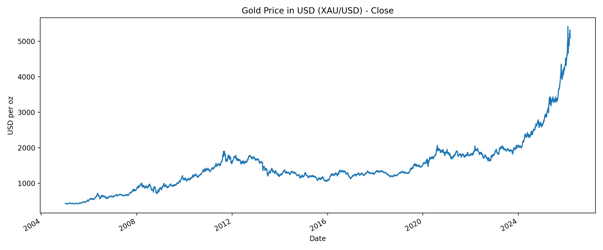
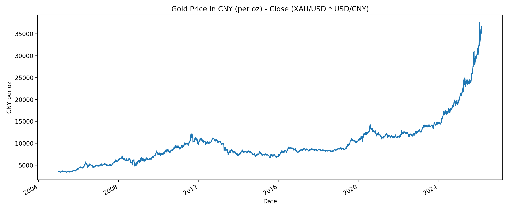
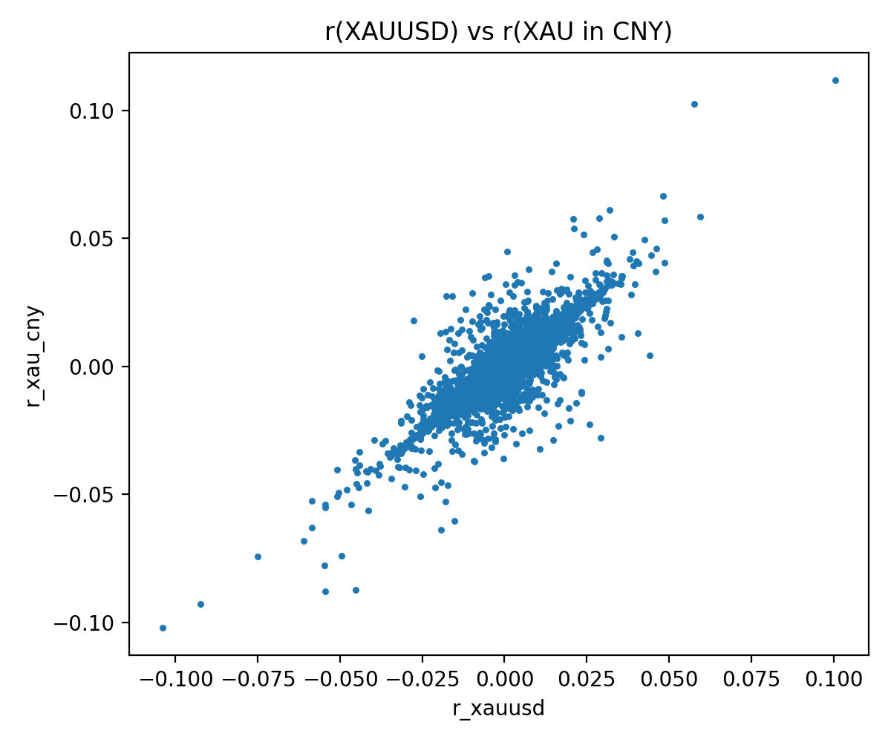
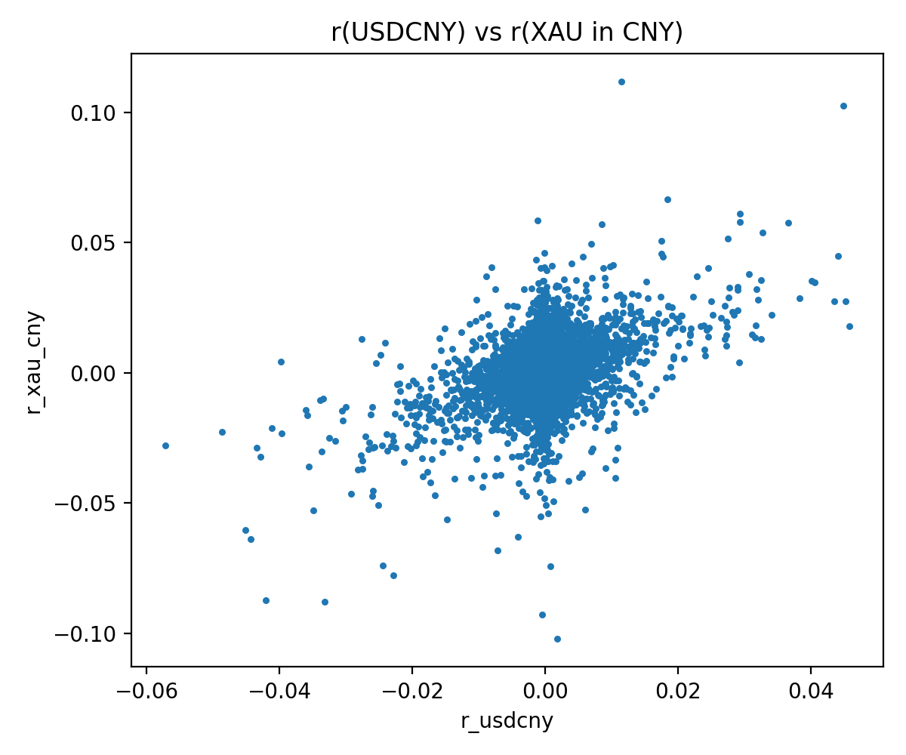

**Live report (GitHub Pages):** https://github.com/YuceZhang/financial-math-learning/edit/main/README.md

# Gold in RMB: USD Gold vs FX Risk (2005–2026)

This project converts gold spot prices from USD (XAU/USD) into RMB using USD/CNY and analyzes return dynamics and risk contributions.

## Key identities
- **Price:** P(CNY gold) = P(USD gold) × USD/CNY  
- **Log return:** r(CNY) ≈ r(USD) + r(FX)

## Data
Daily close prices from Stooq:
- XAU/USD (gold spot)
- USD/CNY (FX rate)

## Tools
Python: pandas, numpy, matplotlib

## Figures

## Results (daily log returns)
**Correlation**
- Corr(XAUUSD, XAU_CNY) ≈ 0.85
- Corr(USDCNY, XAU_CNY) ≈ 0.44
- Corr(XAUUSD, USDCNY) ≈ -0.10

**Annualized volatility (approx., 252 trading days)**
- XAUUSD ≈ 17.8%
- USDCNY ≈ 10.4%
- XAU_CNY ≈ 19.7%

**Variance decomposition of RMB gold return variance**
- USD gold component ≈ 81.4%
- FX component ≈ 28.0%
- Covariance effect ≈ -9.5% (risk offset)

## Notebook
Open \notebook/gold_rmb_analysis.ipynb` and run all cells.`

